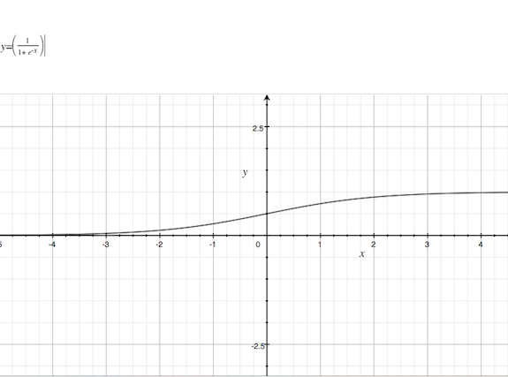

## How birds learn to fly (leaving lots of dead birds on the way)

In this [Flappy Bird](http://www.dotgears.com/apps/app_flappy.html) implementation, there are `neuroEvolution.options.population` birds simultaneously, and most of them will flap helplessly against the pipes or hit the ground, just as we did when we discovered the [sqalid grace of Flappy Bird](https://www.theatlantic.com/technology/archive/2014/02/the-squalid-grace-of-flappy-bird/283526/). Each time a population of birds dies, a new `Generation` is summoned in `game.init()`. During their - in general - short lifespan the birds "see" their own vertical position and the lower edge of the next pipe. Both values are normalized to the range from 0 to 1 (`game.update()`).

Remark: This is different from deep learning examples like this one: [Playing Atari with Deep Reinforcement Learning] (https://deepmind.com/research/publications/playing-atari-deep-reinforcement-learning/). First, our network is small compared to the ones used in deep learning. These network get their input as raw pixel data, while our bird gets its two values handed from the game. Also the "learning" part is very different.

These two inputs feed into their little 'brains', where it gets interesting.

A flappy bird brain consists of a small neural `Network`, made of `Layer`s of `Neuron`s, which have a value and a bunch of weights. There can be an input layer, some hidden layers and one output layer. In fact, our tiny bird has a tiny brain: it consists of merely 2 input neurons, one hidden layer with two neurons and one output neuron. The number of hidden layers and the number of neurons at each layer is provided by a parameter object in the `start` function (`game.js`, `window.onload()`).

Layers and neurons are constructed in `network.generateLayers()`, and the neurons are initialized with random values between -1 and 1 provided by the function `neuroEvolution.options.initialization`.

The current state of a network (the value of all its weights) can also be `encode()`d into and `decode()`d from a network data object.

Most importantly, the network `compute`s an output value. So the bird (of a generation of birds to be exact, more to that later) receives its  
vertical position and the one of the next hole in the pipes, along with an activation function `this.neuvol.options.activation`.

Each input value goes into one input neuron. Then the neurons in the others layers are computed as follows: each neuron first computes the sum of: the value of each neuron from the previous layer multiplied by the weight connecting to that neuron. Then the activation function is run on that sum. Here is the function that ships with this code:

```
activation: function (a) {
  return (1 / (1 + Math.exp(-a)));
}```

And here is how it looks like:


So the activation function keeps the neuron's value between 0 and 1.

The result of this is stored in the value of the neuron. This goes for each neuron in each layer. Finally we arrive at the output layer. Its values are returned from the `compute` function to the `game.update()`: if the first output value is > 0.5 then the bird flaps its tiny wings.

Indeed, our network is so small that we can make an attempt to show what is computes (in pseudocode):

the inputs: `i1`, `i2`

the hidden layer: `h1`, `h2`

the output: `o`

Then the network does this:

```
h1.value = activation(i1.value * h1.weight(i1) + i2.value * h1.weight(i2))
h2.value = activation(i1.value * h2.weight(i1) + i2.value * h2.weight(i2))
o.value = activation(h1.value * o.weight(h1) + h2.value * o.weight(h2))
```

Let's insert the equations:

```
o.value = activation(
  activation(i1.value * h1.weight(i1) + i2.value * h1.weight(i2)) * o.weight(h1) +
  activation(i1.value * h2.weight(i1) + i2.value * h2.weight(i2)) * o.weight(h2)
)
```

The weights are initialized with `neuroEvolution.options.initialization`, which gives  random values between -1 and 1. The inputs are height of the bird and next hole. lets say the bird is at 0.5 and the hole is at 0.77.

```
o.value = activation(
  activation(0.5 * 0.231 + 0.77 * -0.841) * 0.419 +
  activation(0.5 * 0.989 + 0.77 * -0.274) * -0.551
)
= 0.4602711745
```

The bird wouldn't flap. And crash against the pipe. And die. This is because it doesn't "know" it should flap. This "knowledge" can only come from the weights, but they are initialized randomly. In other learning algorithms those weights would be modified over time until they fit the situation, i.e. the bird given those inputs would flap to clear the pipe. But our network does not do anything like this.

How does it work then? 🤔  

This is the end of the Neuro part. Now we come to the Evolution part. Warning: If you believe in 'Creationism', the following could be disturbing.

(to be continued)  

# About the implementation

This is a fork and subsequent rewrite of [https://github.com/xviniette/FlappyLearning/](https://github.com/xviniette/FlappyLearning/). The original code and all artwork in this project is by Vincent Bazia.

This is work in progress.

I like to rewrite code in order to better understand it. Especially in JavaScript, [the world's most misunderstood language](http://www.crockford.com/javascript/javascript.html), it is easy to find issues with the code of others. Due to the [flimsical nature](https://www.w3.org/community/webed/wiki/A_Short_History_of_JavaScript) of the language, even the most prominent experts cannot agree on what is right and what is wrong.

There are [widely publicized  objections](https://medium.com/javascript-scene/how-to-fix-the-es6-class-keyword-2d42bb3f4caf) against the `class` keyword that was introduced in ES6, but I think eventually it will become the `new Normal(pun)`, aside from functional style programming. I also find it natural to translate legacy ES5 `.prototype` constructions into ES6 `class`es, at least as a first step. I think the resulting code is pleasant to read.

Having said that, the code as it is can be simplified dramatically. Everything can be expressed in plain JavaScript objects and arrays: A neuron has a value and a array of weights, a layer has an id and an array of neurons, and so on. Here is an overview:    

```
// neuroevolution.js

Neuron = {
  value: 0,
  weights: [0]
}

Layer = {
  id: 0,
  neurons: [Neuron]
}

Network = {
  layers: [Layer]
}

(NetworkData) = {   // used to store network data in Genomes, see Network.save() and Network.read()
  neurons: [0],     // number of neurons in each layer
  weights: [0]      // flat list of weights
}

Genome = {
  score: 0,
  network: (NetworkData)
}

Generation = {
  genomes: [Genome]
}

Generations = {
  currentGeneration: Generation, // not used
  generation: [Generation]
}

NeuroEvolution = {
  options: {},
  generations: Generations
}

Bird = {
  // ..
}

Pipe = {
  // ..
}

// game.js

Game = {
  birds: [Bird],
  pipes: [Pipe],
  neuvol: NeuroEvolution
  // ..
}
```

I haven't switched the code to modules (yet), I like the simplicity of having a few JavaScript and an HTML file. If the program gets more complex / wants to be tested / re-used, ES6 modules and [webpack](https://webpack.js.org/) would be appropriate.

I run everything through [semistandard](https://github.com/Flet/semistandard).

The game runs on two separate loops: `game.display` uses `requestAnimationFrame` to draw the world, while `game.update` uses `setTimeout` to refresh parameters. The rate can be set in the user interface. To my surprise, the highest speed setting switches to a `window.postMessage` construction (see the top of `game.js`) in favour of `setTimeout(callback, 0)`. I originally planned to get rid of this gnarly  [IFFE](https://en.wikipedia.org/wiki/Immediately-invoked_function_expression), until I learned that it is [significantly faster](https://dbaron.org/log/20100309-faster-timeouts) than the JavaScript event loop.
